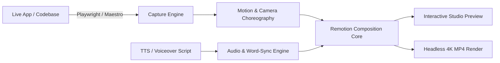

# 🎬 MotionPicturesToolkit

> **Scalable, modular, programmatic motion graphics & promo video engine for web and mobile apps.**

`MotionPicturesToolkit` enables developers, product teams, and founders to convert live codebases and interaction flows into marketing-grade, user-acquisition (UA) worthy 4K promo videos with zero manual editing.

---

## ✨ Features at a Glance

- 🚀 **Automated UI Harvester**: Record live web apps (via Playwright CDP) and mobile apps (iOS/Android) at 60fps with sub-pixel coordinate tracking.
- 🎥 **Virtual Director (Screen Studio Effect)**: Smooths jittery mouse cursors, auto-zooms into active UI hot spots, and adds cinematic camera inertia.
- 📱 **3D & 2.5D Device Frames**: Photorealistic & Clay 3D mockups (iPhone 16 Pro, MacBook Pro 16", iPad Pro M4, Browser Windows) powered by Three.js / React Three Fiber.
- 🔤 **Kinetic Typography & Badges**: Stripe/Linear-style staggered text animations, floating glassmorphic callout pills, and animated metric counters.
- 🎙️ **Synchronized Voiceover & Audio**: Zero-cost, high-quality neural TTS powered by **Edge-TTS** (plus optional ElevenLabs / OpenAI), millisecond word-level karaoke subtitles, procedural sound effects (SFX), and automatic background music ducking.
- 📦 **Multi-Project Workspace**: Isolated project directories with dedicated asset pipelines, structured JSON telemetry logs, and render diagnostics.
- ⚡ **Headless CI/CD Rendering**: Render deterministic 4K 60fps MP4/ProRes videos locally or in cloud CI pipelines (GitHub Actions, AWS Lambda).

---

## 🏗️ Architecture



---

## 🚀 Quick Start

### 1. Initialize Toolkit in your repo
```bash
npx @motion-pictures/cli init
```

### 2. Record an automated user interaction flow
```bash
npx @motion-pictures/cli record --url http://localhost:3000
```

### 3. Preview in the interactive Studio
```bash
npx @motion-pictures/cli preview
```

### 4. Render master video
```bash
npx @motion-pictures/cli render --out ./dist/promo.mp4
```

---

## 📚 Documentation

- 📐 **[System Architecture](docs/ARCHITECTURE.md)**: Deep dive into the 5-layer pipeline and monorepo structure.
- 🗺️ **[Engineering Roadmap](docs/ROADMAP.md)**: Phased milestones from core engine to developer CLI.
- 🔌 **[Integration Guide](docs/INTEGRATION_GUIDE.md)**: How to integrate the toolkit into existing web and mobile codebases.
- 📜 **[Storyboard Specification](docs/STORYBOARD_SPEC.md)**: Declarative schema and types for choreographing scenes, mockups, and audio.

---

## 📂 Project Structure

```
MotionPicturesToolkit/
├── packages/
│   ├── core/                  # Remotion timeline core, camera physics, easing
│   ├── capture/               # Playwright web recorder & mobile bridge
│   ├── mockups/               # 3D & 2.5D device shells (iPhone, Mac, Browser)
│   ├── motion/                # Kinetic text, particle shaders, spotlights
│   ├── audio/                 # TTS synthesis, subtitle sync, SFX matrix, ducking
│   ├── studio/                # Web-based timeline scrubber & inspector
│   └── cli/                   # Developer CLI
├── projects/                  # Isolated user projects & assets
├── docs/                      # Technical specifications & guides
└── README.md
```

---

## 📄 License

MIT © MotionPicturesToolkit Contributors
