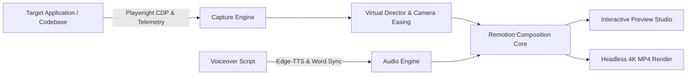

# MotionPicturesToolkit

An open-source, modular, programmatic motion graphics and promo video generation engine. Built on Remotion, Playwright, React Three Fiber, and Edge-TTS, MotionPicturesToolkit automates the production of high-converting, marketing-grade product videos directly from web and mobile codebases.

---

## Showcase Demo
https://github.com/user-attachments/assets/609738bb-5360-4e07-a0e4-470c32db1f8f
<video src="[https://github.com/theGoodB0rg/MotionPicturesToolkit/releases/download/v1.0.0/promo.mp4](https://github.com/user-attachments/assets/609738bb-5360-4e07-a0e4-470c32db1f8f)" controls="controls" width="100%">
</video>

*30-second automated product demo featuring zero-cost neural voiceover, millisecond-accurate kinetic karaoke subtitles, 3D MacBook Pro mockup, and dynamic audio ducking.*

---

## Core Capabilities

- **Deterministic UI Ingestion**: Automate interaction recording from web apps via Playwright CDP and mobile applications via emulator bridges with sub-pixel coordinate logging.
- **Virtual Director Camera Engine**: Interpolate raw cursor and viewport inputs into smooth spring-eased trajectories with automatic focal framing, 3D rotational inertia, and spotlight dimming.
- **3D & 2.5D Device Mockups**: Photorealistic and clay hardware models (iPhone 16 Pro, MacBook Pro 16", Safari/Chrome browser chromes) powered by Three.js and `@remotion/three`.
- **Kinetic Typography & Marketing Components**: Stripe- and Linear-style staggered letter reveals, blur-to-focus titles, glassmorphic floating callout pills, and responsive Bento grids.
- **Synchronized Audio & Voice Pipeline**: Zero-cost, high-fidelity neural speech synthesis via Edge-TTS with sub-millisecond word boundary extraction, procedural sound effects (SFX), and automatic background music ducking (-14 dB).
- **Multi-Project Isolation**: Structured workspaces with dedicated configuration files (`motion.config.ts`), declarative storyboards (`storyboard.ts`), asset pipelines, and structured JSON telemetry logs.
- **Headless CI/CD Rendering**: Deterministic multi-core parallel rendering to 4K 60fps MP4, WebM, or ProRes locally and within GitHub Actions pipelines.

---

## System Architecture



---

## Quick Start

### 1. Initialize Toolkit in an Existing Repository

```bash
npx @motion-pictures/cli init
```

This generates `motion.config.ts` and `storyboard.ts` in your project root.

### 2. Record an Automated Interaction Flow

```bash
npx @motion-pictures/cli record --url http://localhost:3000
```

### 3. Synthesize Neural Voiceover & Word Boundaries

```bash
npx @motion-pictures/cli audio:generate --text "Your marketing script here"
```

### 4. Preview in Interactive Studio

```bash
npx @motion-pictures/cli preview
```

### 5. Render Production Video

```bash
npx @motion-pictures/cli render --out ./dist/promo.mp4
```

---

## Declarative Storyboard Example

Define scene choreography, camera trajectories, voiceover, and badges in TypeScript:

```typescript
import { defineStoryboard, Scene } from '@motion-pictures/core';

export default defineStoryboard([
  Scene.Hook({
    durationSeconds: 5,
    title: 'Transform Code into Cinema',
    subtitle: 'Automated 4K product motion graphics from live application code.',
    badgeText: 'NextGen Motion Engine',
    voiceover: 'Stop spending weeks manually editing product videos.',
    transition: 'fade',
  }),

  Scene.AppDemo({
    durationSeconds: 10,
    device: 'macbook-pro-16',
    headline: 'Realtime Telemetry & Dynamic Director',
    camera: {
      initialZoom: 1.0,
      moves: [
        { atFrame: 45, zoom: 1.35, target: 'top-right', duration: 40 },
        { atFrame: 200, zoom: 1.15, target: 'center', duration: 35 },
      ],
    },
    callouts: [
      { atFrame: 60, text: 'Instant Telemetry Capture', position: 'top-left' },
      { atFrame: 180, text: 'Sub-Pixel Smooth Zoom', position: 'bottom-right' },
    ],
    voiceover: 'MotionPicturesToolkit automatically records your application and adds smooth camera pans.',
    transition: 'slide-left',
  }),

  Scene.CallToAction({
    durationSeconds: 5,
    title: 'Start Creating Cinema from Code',
    ctaButtonText: 'npx motion-pictures init',
    brandUrl: 'https://motionpictures.dev',
    voiceover: 'Integrate into your codebase today and launch your next video.',
    transition: 'fade-through-black',
  }),
]);
```

---

## Monorepo Packages

| Package | Version | Description |
| :--- | :--- | :--- |
| [`@motion-pictures/core`](packages/core) | `1.0.0` | Remotion timeline core, camera coordinate math, spring physics presets, `<CinematicCanvas>`, `<SceneSequence>`, and trace logging. |
| [`@motion-pictures/mockups`](packages/mockups) | `1.0.0` | 3D & 2.5D device frames: `<SafariBrowserFrame>`, `<MacBookMockup>`, `<IPhone16Mockup>`, and universal `<DeviceContainer>`. |
| [`@motion-pictures/motion`](packages/motion) | `1.0.0` | Motion graphics library: `<KineticHeadline>`, `<PillCallout>`, `<MeshGradientBackground>`, `<CursorPointer>`, `<BentoGrid>`, and `<SpotlightOverlay>`. |
| [`@motion-pictures/audio`](packages/audio) | `1.0.0` | Zero-cost Edge-TTS client, native word-boundary extractor, `<KineticSubtitles>` (karaoke highlight), and dynamic audio ducking. |
| [`@motion-pictures/capture`](packages/capture) | `1.0.0` | Playwright CDP screen harvester, `defineScenario` interaction harness, and telemetry coordinate exporter. |
| [`@motion-pictures/cli`](packages/cli) | `1.0.0` | Command line interface (`init`, `record`, `preview`, `render`, `audio:generate`). |

---

## Documentation

- [System Architecture](docs/ARCHITECTURE.md): Technical specification of the 5-layer pipeline and data flows.
- [Engineering Roadmap](docs/ROADMAP.md): Multi-phase development roadmap and milestones.
- [Integration Guide](docs/INTEGRATION_GUIDE.md): Implementation guide for existing web and mobile repositories.
- [Storyboard Specification](docs/STORYBOARD_SPEC.md): Complete schema and type definitions for the Storyboard DSL.

---

## Development

```bash
# Install dependencies
pnpm install

# Build all packages
pnpm run build

# Typecheck workspace
pnpm run typecheck

# Preview demo SaaS promo
pnpm --filter demo-saas-web preview

# Render 1080p 60fps MP4 demo
pnpm --filter demo-saas-web exec remotion render src/index.ts MainPromo out/promo.mp4 --concurrency=4 --public-dir=public
```

---

## License

MIT © MotionPicturesToolkit Contributors
