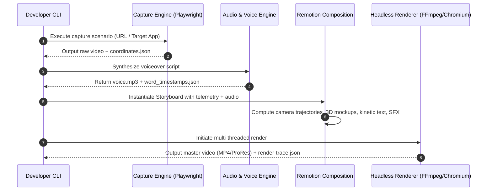

# System Architecture Specification: MotionPicturesToolkit

`MotionPicturesToolkit` is an open-source, modular, programmatic motion graphics and promo video generation engine. It enables developers, growth engineers, and creative teams to transform live web and mobile codebases into marketing-grade, user acquisition (UA) worthy video assets.

---

## 1. High-Level Architecture

The toolkit is architected around a 5-layer pipeline:

```mermaid
flowchart TD
    subgraph Layer1 [1. INGESTION & HARVESTING LAYER]
        WebSource["Web App (Playwright / CDP)"]
        MobileSource["Mobile App (Maestro / Appium)"]
        ComponentSource["Isolated React / DOM Components"]
        AssetSource["Figma / Brand Assets / Vector Graphics"]
    end

    subgraph Layer2 [2. HARVESTED TELEMETRY & ASSET PIPELINE]
        RawVideo["High-Bitrate UI Video Stream"]
        Telemetry["Interaction Event Log (Mouse, Tap, Scroll, Timestamps)"]
        BoundingBoxes["Element Bounding Boxes & Metadata"]
        AudioScript["Voiceover Script & Transcript Tokens"]
    end

    subgraph Layer3 [3. MOTION, MOCKUP & AUDIO CHOREOGRAPHY]
        VirtualDirector["Virtual Director (Auto-Zoom, Camera Smooth, Inertia)"]
        DeviceMockups["3D & 2.5D Device Frames (iPhone 16 Pro, MacBook, Browser)"]
        KineticMotion["Kinetic Typography, Spotlight Badges, Mesh Gradients"]
        AudioEngine["TTS (ElevenLabs/Edge-TTS) + Word-Sync + SFX Matrix + Ducking"]
    end

    subgraph Layer4 [4. COMPOSITION & RENDERING CORE]
        RemotionCore["Remotion 4.x Composition Engine"]
        R3F["React Three Fiber / Three.js Canvas Layer"]
        Studio["Interactive Motion Studio (Live Scrubber & Inspector)"]
    end

    subgraph Layer5 [5. EXPORT & DISTRIBUTION LAYER]
        HeadlessCLI["Headless Parallel Multi-Core Render"]
        OutputFormats["MP4 (H.264/H.265) / ProRes / WebM / GIF"]
        ProjectArtifacts["Structured Logs, Traces, Frame Debug Dumps"]
    end

    Layer1 --> Layer2
    Layer2 --> Layer3
    Layer3 --> Layer4
    Layer4 --> Layer5
```



---

## 2. Monorepo Package Breakdown

The codebase is organized as a modular TypeScript monorepo with strict package boundaries:

```
MotionPicturesToolkit/
├── packages/
│   ├── @motion-pictures/core/       # Core timeline primitives, camera easing, math, layout systems
│   ├── @motion-pictures/capture/    # Playwright browser harvester & mobile event bridge
│   ├── @motion-pictures/mockups/    # 3D (R3F) and 2.5D device shells, browser chromes, clay frames
│   ├── @motion-pictures/motion/     # Kinetic typography, spotlight callouts, particle shaders, mesh gradients
│   ├── @motion-pictures/audio/      # TTS synthesizers, word-level caption aligner, procedural SFX, ducking
│   ├── @motion-pictures/studio/     # Web-based visual timeline preview & storyboard inspector
│   └── @motion-pictures/cli/        # Developer CLI (`init`, `record`, `render`, `inspect`)
├── projects/                        # Multi-project workspace instances
│   └── <project-slug>/              # Isolated project configuration, assets, logs, renders
└── docs/                            # Architecture, roadmaps, storyboard specs, integration guides
```

---

## 3. Detailed Subsystem Specifications

### 3.1. Capture & Harvesting Engine (`@motion-pictures/capture`)
- **Playwright CDP Recorder**: Hooks into Chrome DevTools Protocol to capture 60fps high-DPI viewports while intercepting mouse and keyboard coordinates.
- **Event Log Normalizer**: Translates raw mouse movements and click coordinates into smooth parametric spline paths, filtering out micro-jitters.
- **Bounding Box Tracker**: Attaches telemetry observers to target DOM selectors (e.g., `data-motion="cta-button"`) to export exact `(x, y, width, height)` coordinates per frame.
- **Mobile Stream Receiver**: Interfaces with mobile emulator/device streams (via `xcrun simctl` or Android ScreenCap) to record touch gestures, swipes, and app screens.

### 3.2. Motion & Mockup Engine (`@motion-pictures/mockups` & `@motion-pictures/motion`)
- **Virtual Director / Camera Controller**:
  - Automatically calculates optimal camera focal length, pan vectors, and zoom factors based on the current interaction bounding box.
  - Implements realistic camera inertia, spring damping (`react-spring` / Remotion `spring()`), and subtle 3D parallax tilt.
- **3D Device Renders**:
  - Uses `@remotion/three` with custom Three.js shaders to wrap recorded streams onto 3D hardware models:
    - Apple iPhone 16 Pro (Natural Titanium, Black Titanium, Clay Minimalist)
    - Apple MacBook Pro 16" (Liquid Retina, Notch, Aluminum Shell)
    - Apple iPad Pro M4 (Ultra Retina XDR)
    - Minimalist Browser Chrome (Safari, Arc, Chrome with customizable URL bar and action buttons)
- **Kinetic Typography & Marketing Callouts**:
  - Stripe/Linear-style staggered text reveals, blur-to-focus titles, and glowing pill badges.
  - Interactive UI magnifiers and spotlight dimming (darkening background UI by 70% to emphasize hero features).

### 3.3. Audio & Voice Design Engine (`@motion-pictures/audio`)
- **Edge-TTS Zero-Cost Neural Engine (Default)**:
  - High-fidelity Microsoft Edge Neural TTS voices (e.g., `en-US-ChristopherNeural`, `en-US-JennyNeural`, `en-US-GuyNeural`, `en-GB-SoniaNeural`).
  - Native word-boundary extraction for millisecond-accurate timestamp alignment without requiring external paid API keys.
  - Pluggable provider architecture: Edge-TTS (default), ElevenLabs, OpenAI TTS, and Local Kokoro.
- **Karaoke & Kinetic Subtitles**:
  - Automatically transforms word boundary timestamps into animated subtitle sequences with glow accents, letter hops, and active word highlights.
- **Procedural Sound Design (SFX Matrix)**:
  - Timeline-triggered sound effects:
    - *Mouse clicks & taps*: Soft mechanical pops, tactile taps.
    - *Scene transitions*: Clean atmospheric whooshes, riser sweeps.
    - *Success states / Badges*: Subtle glass chimes, synthetic sub-bass drops.
- **Smart Audio Ducking**:
  - Computes audio volume envelopes dynamically. Background music volume automatically drops by `-14dB` during active voiceover segments and ramps back up over `350ms`.

### 3.4. Multi-Project Isolation & Structured Logging (`projects/<project-id>`)
Every project maintains dedicated folders to ensure complete separation of concerns and debuggability:
```
projects/saas-landing-launch/
├── motion.config.ts         # Branding tokens, output resolution, FPS, theme colors
├── storyboard.ts            # Declarative scene graph, camera moves, voiceover scripts
├── assets/
│   ├── raw/                 # Captured web/mobile recordings
│   ├── audio/               # Voiceover mp3s, background tracks, SFX files
│   └── screenshots/         # High-res vector/raster snapshots
├── cache/                   # Transcoded video chunks, TTS timestamp cache
├── logs/
│   ├── capture-trace.json   # DOM coordinates & interaction timestamps
│   └── render-trace.json    # Frame rendering durations, memory usage, pipeline diagnostics
└── dist/
    └── promo_1080p60.mp4    # Final rendered video artifact
```

---

## 4. Pipeline Data Flow



---

## 5. Security & Determinism Principles

1. **Deterministic Frame Calculation**: All animations are functions of `frameIndex` (e.g., `frame / fps`), completely eliminating drift or frame drops during slow renders.
2. **Server-Side API Isolation**: API keys (ElevenLabs, OpenAI) are executed strictly in Node.js build processes and never bundled into client-side compositions.
3. **Reproducible Builds**: All asset paths, fonts, sound effects, and 3D models are pinned and content-hashed.
