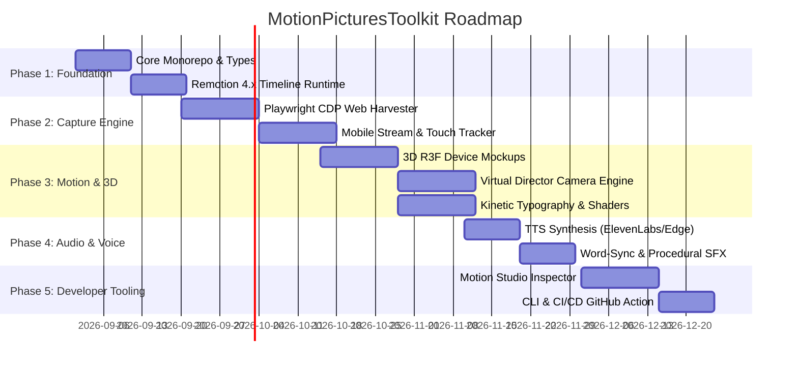

# Engineering Roadmap: MotionPicturesToolkit

This document outlines the phased development and production roadmap for `MotionPicturesToolkit`.

---

## Roadmap Overview

---

## Milestone Breakdown

### Phase 1: Core Engine & Animation Primitives
**Goal**: Build the foundation for deterministic, frame-accurate animation math, camera physics, and composition lifecycle.

- [ ] **1.1 Workspace Setup**: pnpm monorepo with Turborepo, TypeScript 5.x, strict linting, and Remotion 4.x.
- [ ] **1.2 `@motion-pictures/core`**:
  - `Interpolation` & `Spring` math wrappers with customizable mass, tension, and friction.
  - Coordinate transform matrix calculators for 2D/3D camera viewpoints.
  - Composition layout primitives (`<SceneSequence>`, `<CinematicCanvas>`, `<OverlayLayer>`).
- [ ] **1.3 Telemetry Data Schema**:
  - Standardized JSON schema for cursor paths, keypresses, viewport changes, and element bounds.

---

### Phase 2: Ingestion & Telemetry Capture Engine
**Goal**: Automate real-world screen recording and interaction capture from web and mobile applications with zero manual screen-capping.

- [ ] **2.1 `@motion-pictures/capture` (Web)**:
  - Playwright test runner wrapper that logs mouse trajectories, click timestamps, and bounding boxes.
  - Viewport recorder operating at 60fps / 4K with transparent cursor suppression (so synthetic smooth cursors can be added later).
  - DOM Snapshot harvester for high-res vector rendering of isolated UI components.
- [ ] **2.2 Mobile Capture Bridge**:
  - Android ScreenCap & iOS Simulator video stream grabber.
  - Touch event telemetry parser to overlay animated touch ripple indicators.
- [ ] **2.3 Asset Transcoder & Optimizer**:
  - FFmpeg pipeline to transcode raw captures into frame-accurate intra-frame video formats (ProRes / fast H.264).

---

### Phase 3: Motion Library, 3D Mockups & Camera Director
**Goal**: Elevate raw captures to Apple/Linear-grade marketing assets with dynamic camera choreography and 3D device framing.

- [ ] **3.1 `@motion-pictures/mockups` (3D & 2.5D)**:
  - `@remotion/three` integration with realistic lighting, specular reflections, and ambient shadows.
  - Devices: iPhone 16 Pro, MacBook Pro 16", iPad Pro M4, Minimalist Safari/Chrome browser chromes.
  - Dynamic material switcher: Photorealistic Metallic, Clay Matte, Glassmorphism.
- [ ] **3.2 `@motion-pictures/motion` (Virtual Director)**:
  - *Smooth Cursor Engine*: Translates jerky manual mouse movements into fluid, cinematic bezier curves.
  - *Auto-Framing Camera*: Pans and zooms into active interaction hotspots with smooth spring easing.
  - *Spotlight Focus*: Dims non-essential UI regions with depth-of-field blur and radial lighting.
- [ ] **3.3 Kinetic Typography & Visual Polish**:
  - Stripe/Linear-style kinetic headline reveals.
  - Floating pill callouts, tooltip badges, and animated metric counters.
  - Background generators: Animated mesh gradients, geometric grids, particle dust.

---

### Phase 4: Audio Engineering, Edge-TTS & Subtitle Sync
**Goal**: Fully automated sound design, zero-cost Edge-TTS voiceover synthesis, and kinetic subtitle timing.

- [ ] **4.1 `@motion-pictures/audio` (Voiceover Engine)**:
  - Edge-TTS default integration with native word-boundary extractor (`node-edge-tts` / `msedge-tts`) for zero-cost, zero-API-key neural voice generation.
  - Pluggable provider support (ElevenLabs, OpenAI TTS) for custom enterprise voices.
- [ ] **4.2 Kinetic Subtitle Synchronizer**:
  - Word-by-word karaoke highlighting, bouncy text physics, and customizable subtitle presets (TikTok/Reels style, Apple Minimalist, SaaS Clean).
- [ ] **4.3 Sound Effects (SFX Matrix) & Dynamic Ducking**:
  - Procedural sound effect mapping (whoosh on scene transitions, click on button taps, riser on climax).
  - Dynamic volume envelope that automatically ducks background music by `-14dB` during voiceover playback.

---

### Phase 5: Developer Studio, CLI & CI/CD Pipeline
**Goal**: Seamless developer ergonomics for integrating into external repositories and automating video generation in CI.

- [ ] **5.1 `@motion-pictures/studio`**:
  - Interactive preview studio with live timeline scrubber, camera path visualizer, and asset hot-reloading.
  - Element bounding box debug inspector.
- [ ] **5.2 `@motion-pictures/cli`**:
  - `npx motion-pictures init` (scaffolds `motion.config.ts` and starter storyboard in any repo).
  - `npx motion-pictures record --url <url>` (runs automated capture scenario).
  - `npx motion-pictures render --project <name>` (renders master MP4).
- [ ] **5.3 CI/CD & Headless Integration**:
  - GitHub Action for automated promo video generation on releases and pull requests.
  - Cloud rendering presets for AWS Lambda (via Remotion Lambda) or local GPU instances.
