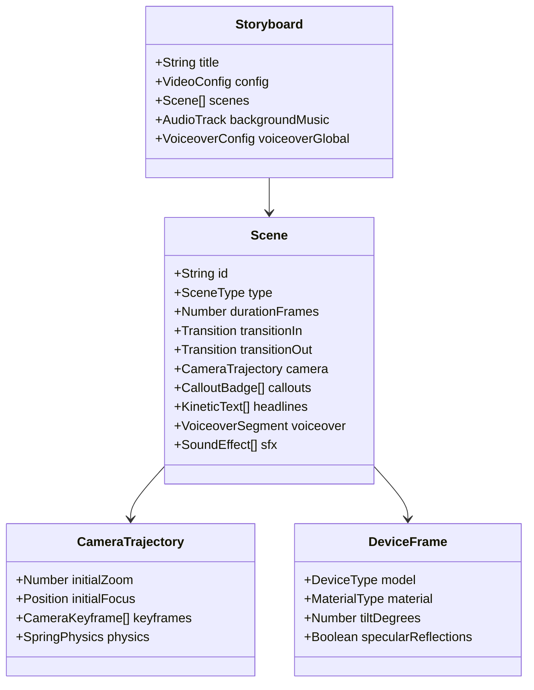

# Storyboard DSL Specification: MotionPicturesToolkit

The `MotionPicturesToolkit` Storyboard DSL provides a type-safe, human-readable, and LLM-friendly declarative format for orchestrating high-converting product videos.

---

## 1. Storyboard Schema Hierarchy



---

## 2. Standard Scene Types

The DSL provides high-conversion marketing scene archetypes:

### 2.1. `Scene.Hook` (Problem / Value Statement)
- **Purpose**: Grab attention within the first 3 seconds of a marketing video.
- **Visuals**: Bold kinetic typography, dark glowing background with subtle particle flow, high-contrast title card.
- **Props**:
  - `title`: string
  - `subtitle`: string
  - `badge`: `{ text: string, icon?: string }`
  - `accentEffect`: `'glow' | 'lens-flare' | 'matrix-grid' | 'none'`

### 2.2. `Scene.AppDemo` (Feature Showcase / Live UI)
- **Purpose**: Showcase the product interface in action with smooth auto-zoom, cursor tracking, and device framing.
- **Visuals**: 3D iPhone/MacBook mockup or floating browser window with active live recordings, camera pans, and callouts.
- **Props**:
  - `source`: Video path or live component
  - `device`: `'iphone-16-pro' | 'macbook-pro-16' | 'ipad-pro' | 'safari-window' | 'clay-phone' | 'none'`
  - `camera`: Camera trajectory configuration
  - `callouts`: Array of floating badges pinned to UI coordinates

### 2.3. `Scene.FeatureBento` (Multi-Feature Grid)
- **Purpose**: Rapidly display 3 to 4 key capabilities in a synchronized Bento grid layout.
- **Visuals**: Animated cards staggering in with icons, stat counters, and micro-animations.
- **Props**:
  - `items`: Array of `{ title: string, icon: string, stat?: string, videoSnippet?: string }`

### 2.4. `Scene.SocialProof` / `Scene.Metrics` (Credibility / Metrics)
- **Purpose**: Build trust with high-converting social proof metrics (e.g., "10M+ users", "99.9% uptime").
- **Visuals**: Animated metric counters, customer avatar stacks, or quote cards.

### 2.5. `Scene.CallToAction` (Final Pitch & Conversion)
- **Purpose**: Drive user action (signups, downloads, GitHub stars).
- **Visuals**: Glowing primary button, install command (`npx motion-pictures init`), brand logo, and domain URL.

---

## 3. Camera Choreography & Physics Specification

```typescript
export interface CameraKeyframe {
  /** Frame number relative to scene start */
  atFrame: number;
  /** Camera zoom level (1.0 = full frame, 2.0 = 2x magnification) */
  zoom: number;
  /** Focus target coordinate or preset */
  target: 'center' | 'top-left' | 'top-right' | 'bottom-left' | 'bottom-right' | { x: number; y: number };
  /** Transition duration in frames */
  duration: number;
  /** Spring physics preset */
  easing?: 'snappy' | 'smooth' | 'gentle' | 'bouncy';
}
```

---

## 4. Audio & Sound Effect Matrix

Sound effects can be triggered explicitly or auto-inferred from UI actions:

```typescript
export interface SoundEffectTrigger {
  atFrame: number;
  effect:
    | 'whoosh-fast'
    | 'whoosh-cinematic'
    | 'keyboard-tap'
    | 'mouse-click'
    | 'pop-modern'
    | 'success-chime'
    | 'sub-bass-drop';
  volume?: number; // 0.0 to 1.0 (default: 0.8)
}
```
